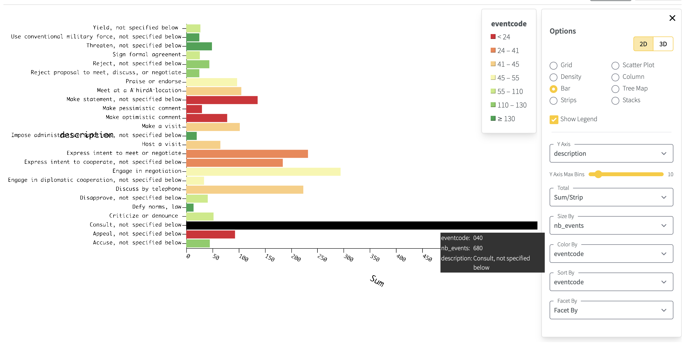

# GDELT
From the [GDELT](https://gdeltproject.org) project:

>  Put simply, the GDELT Project is a realtime open data global graph over human society as seen through the eyes of the world's news media, reaching deeply into local events, reaction, discourse, and emotions of the most remote corners of the world in near-realtime and making all of this available as an open data firehose to enable research over human society.

Yellowbrick provides a way to setup tables to perform analytic queries on the two of the main fact sources within GDELT 2.0 Event Database:
 * **gdelt.events** - events reported from 65 live translated languages
 * **gdelt.mentions** - additional data about each event

The main source for the Global Knowledge Graph is also supported:
 * **gdelt.gkg** - the world’s largest open data graph over global human society

In addition, a number of lookup tables are provided to support analytic queries:
 * **gdelt.eventcodes**
 * **gdelt.types**
 * **gdelt.groups**
 * **gdelt.countries**

## Sources

* Amazon Open Data Registry: https://registry.opendata.aws/gdelt/
* S3 Bucket: https://gdelt-open-data.s3.amazonaws.com/

##

## Queries

We drew some inspiration from a great blog article and public github repository
from here: https://julsimon.medium.com/exploring-the-gdelt-data-set-with-amazon-athena-a6f7b1d67a6e

There are a number of these queries which have been provided, such as
[Obama and Putin, Events Per Category](./queries/gdelt-obama-and-putin-events-per-category.sql)

``` sql
-- Count Obama/Putin and Putin/Obama events per category
WITH tmp as (SELECT gdelt.events.eventcode,
         COUNT(gdelt.events.globaleventid) AS nb_events
    FROM gdelt.events
    WHERE ((actor1name LIKE '%OBAMA' and actor2name LIKE '%PUTIN')
            OR (actor2name LIKE '%OBAMA' and actor1name LIKE '%PUTIN'))
    GROUP BY  gdelt.events.eventcode
    ORDER BY  nb_events DESC)
SELECT eventcode,
         gdelt.eventcodes.description,
         nb_events
FROM tmp
JOIN gdelt.eventcodes
    ON eventcode = gdelt.eventcodes.code
ORDER BY  nb_events DESC
LIMIT 25;

```

Which you can then visualize in the query results explorer:




See the "Files" section to load each of the sample queries.
